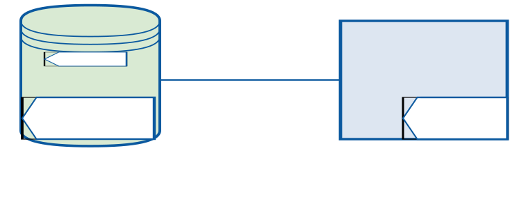

== REMOTE BACKUP AND RESTORE WITH PGBACKREST

We need two servers. Let’s call ours:

* pgbackup
* db1

=== Build
Refer ->
link:1.build.adoc[Build pgBackRest from source]

=== Installing pgbackrest:

We need to install pgBackRest on the database and the backup server. Make sure you install the same version on both.

==== For the database server,

==== For the backup server,

Create a pgbackrest user on the backup server

[source, shell]
----
sudo adduser --disabled-password --gecos "" pgbackrest
----
===== Install required Perl package and pgBackRest from a package or manually on pgbackup as below
[source, shell]
sudo apt-get install libdbd-pg-perl
sudo scp BUILD_HOST:/root/pgbackrest-release-2.39/src/pgbackrest /usr/bin/
sudo chmod 755 /usr/bin/pgbackrest
----

==== Create pgBackRest configuration files, directories and repository on pgbackup
 
[source, shell]
----
sudo mkdir -p -m 770 /var/log/pgbackrest
sudo chown pgbackrest:pgbackrest /var/log/pgbackrest
sudo mkdir -p /etc/pgbackrest
sudo mkdir -p /etc/pgbackrest/conf.d
sudo touch /etc/pgbackrest/pgbackrest.conf
sudo chmod 640 /etc/pgbackrest/pgbackrest.conf
sudo chown pgbackrest:pgbackrest /etc/pgbackrest/pgbackrest.conf
 
sudo mkdir -p /var/lib/pgbackrest
sudo chmod 750 /var/lib/pgbackrest
sudo chown pgbackrest:pgbackrest /var/lib/pgbackrest
----

Now we are ready to proceed with enabling communication between the database and the backup server. For that, pgBackRest requires a passwordless SSH connection.

== Passwordless SSH Connection

To know more about link:https://github.com/m-thirumal/linux-guide/blob/main/ssh/Passwordless_Login.adoc[Passwordless SSH Connection] 

We can do that by generating an SSH authentication key file using the command

[source, shell]
----
ssh-keygen
----

=== On the pgbackup server as pgbackrest user

Create `.ssh` folder and generate `key` using the following commands 

[source, shell]
----
sudo -u pgbackrest mkdir -m 750 /home/pgbackrest/.ssh
sudo -u pgbackrest ssh-keygen -f /home/pgbackrest/.ssh/id_rsa -t rsa -b 4096 -N ""
----

=== On db1 as postgres user:
Create `.ssh` folder and generate `key` using the following commands
[source, shell]
----
sudo -u postgres mkdir -m 750 -p /var/lib/postgresql/.ssh
sudo -u postgres ssh-keygen -f /var/lib/postgresql/.ssh/id_rsa -t rsa -b 4096 -N ""
----

==== Exchange the public keys generated between the servers

==== On pgbackup:
Login to `pgbackrest` user to rund the following command because the following command takes key from current user home directory

[source, shell]
----
cat ~/.ssh/id_rsa.pub | ssh postgres@db1 "cat >> ~/.ssh/authorized_keys"
----

==== On db1:
Go to `/var/lib/postgres/.ssh/` directory and run the following command, because `postgres` default home directory is `/var/lib/postgres`

[source, shell]
----
cat id_rsa.pub | ssh pgbackrest@pgbackup "cat >> ~/.ssh/authorized_keys"
----

Test the passwordless connection as follows:

[source, shell]
----
sudo -u pgbackrest ssh postgres@db1

sudo -u postgres ssh pgbackrest@repository
----

== Configuration

On the `pgbackup server`, configure the `pgBackRest` configuration file with the database `host and path`, along with the `repository path` where the backups will be `stored`. We have added the database host as `pg1-host` so that we can add more database hosts later as `pg2-host` and so on. The same goes for `pg1-path`.

[source, shell]
----
cat /etc/pgbackrest/pgbackrest.conf
[demo]
pg1-host=db1
pg1-path=/var/lib/postgresql/10/main
 
[global]
repo1-path=/var/lib/pgbackrest
repo1-retention-full=2
start-fast=y
----

The Start Fast Option `(--start-fast)` has been used to force a checkpoint to start the backup quickly. Otherwise, the backup will start after the next regular checkpoint.

 

On server `db1`, configure the pgBackRest configuration file with the database path and backup host as follows in the file

`cat /etc/pgbackrest/pgbackrest.conf``

[source,shell]
----
[demo]
pg1-path=/var/lib/postgresql/10/main
 
[global]
log-level-file=detail
repo1-host=pgbackup
----

On db1, update `postgresql.conf` to have the following changes:
[source, shell]
----
archive_command = 'pgbackrest --stanza=demo archive-push %p'
archive_mode = on
listen_addresses = '*'
log_line_prefix = ''
max_wal_senders = 3
wal_level = replica
----

Now restart `PostgreSQL` to reflect the configuration changes.

== Create Stanza on pgBackRest server

Create a stanza on the pgbackup server and check if it’s working. Getting no result means the stanza has been created successfully.

[source, shell]
----
sudo -u pgbackrest pgbackrest --stanza=demo stanza-create
sudo -u pgbackrest pgbackrest --stanza=demo check
----

Check if the stanza configuration is correct on db1:

[source, shell]
----
sudo -u postgres pgbackrest --stanza=demo check
----

== Backup
With the setup ready, let’s take our first remote backup from pgbackup. The default backup is incremental, but the first backup is always a full backup.

[source, shell]
----
sudo -u pgbackrest pgbackrest --stanza=demo backup
sudo -u pgbackrest pgbackrest --stanza=demo info
----
You will find directories and files being created in the backup location.

== Schedule the backup

 link:5.Schedule Backup.adoc[scheduler]

== Restore

Taking a full backup was easy. Let’s see some examples of incremental backup and recovery with a target:

Create a test database on db1:

[source, shell]
----
postgres=# create database test;
CREATE DATABASE
postgres=# \l
List of databases
    Name   |  Owner   | Encoding |   Collate   |    Ctype    | Access privileges
-----------+----------+----------+-------------+-------------+-----------------------
 postgres  | postgres | UTF8     | en_US.UTF-8 | en_US.UTF-8 |
 template0 | postgres | UTF8     | en_US.UTF-8 | en_US.UTF-8 | =c/postgres postgres=CTc/postgres
 template1 | postgres | UTF8     | en_US.UTF-8 | en_US.UTF-8 | =c/postgres  postgres=CTc/postgres
 test      | postgres | UTF8     | en_US.UTF-8 | en_US.UTF-8 |
(4 rows)
----

Make another backup. By default, this will be incremental since it’s the second backup and we are not specifying the type:

[source,shell]
----
sudo -u pgbackrest pgbackrest --stanza=demo backup
----

To restore, stop PostgreSQL on db1 and run pgbackrest with the restore command:

[source,shell]
----
sudo service postgresql stop
sudo -u postgres pgbackrest --stanza=demo --delta restore
sudo service postgresql start
----

If you check the database now, you will not find the test database. This is because the backup was restored from the first full backup.

[source, shell]
----
postgres=# \l
List of databases
   Name    |  Owner   | Encoding | Collate     | Ctype       | Access privileges
-----------+----------+----------+-------------+-------------+-----------------------
 postgres  | postgres  | UTF8    | en_US.UTF-8 | en_US.UTF-8 |
 template0 | postgres  | UTF8    | en_US.UTF-8 | en_US.UTF-8 | =c/postgres postgres=CTc/postgres
 template1 | postgres  | UTF8    | en_US.UTF-8 | en_US.UTF-8 | =c/postgres postgres=CTc/postgres
(3 rows)
----

To restore the data up to the incremental backup, run the restore command with `recovery_target` in `--recovery-option``.

[source,shell]
----
sudo service postgresql stop
sudo -u postgres pgbackrest --stanza=demo --delta restore \
                            --recovery-option=recovery_target=immediate
sudo service postgresql start
----

Let’s check the database now:
[source, shell]
----
postgres=# \l
                                  List of databases
   Name    |  Owner   | Encoding |   Collate   |    Ctype    |   Access privileges  
-----------+----------+----------+-------------+-------------+-----------------------
 postgres  | postgres | UTF8     | en_US.UTF-8 | en_US.UTF-8 | 
 template0 | postgres | UTF8     | en_US.UTF-8 | en_US.UTF-8 | =c/postgres          +
           |          |          |             |             | postgres=CTc/postgres
 template1 | postgres | UTF8     | en_US.UTF-8 | en_US.UTF-8 | =c/postgres          +
           |          |          |             |             | postgres=CTc/postgres
 test      | postgres | UTF8     | en_US.UTF-8 | en_US.UTF-8 | 
(4 rows)
----
